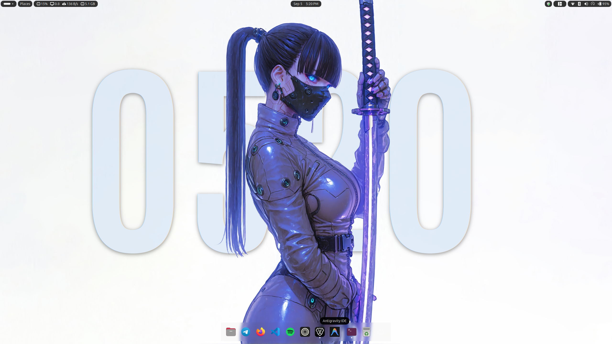
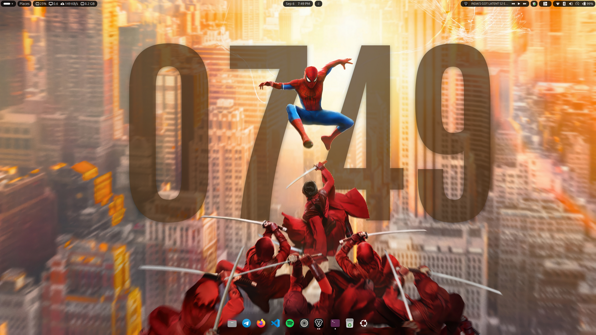
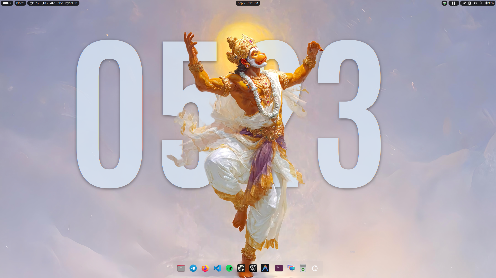
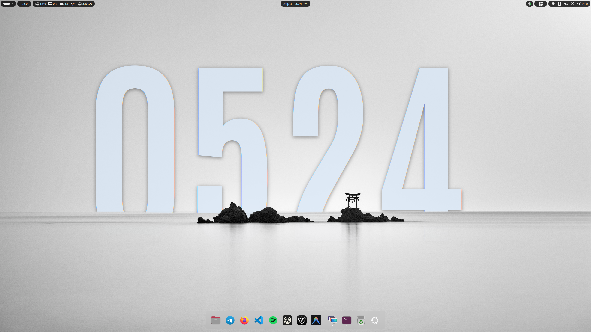

# Depth Clock

Depth Clock is a GNOME Shell extension that brings an iOS-style 3D depth effect clock to your Linux desktop wallpaper. By running an on-device AI segmentation model, the extension separates foreground subjects from your desktop wallpaper and renders a customizable clock tucked naturally behind foreground elements.

## Previews


| | |
| :---: | :---: |
|  |  |
|  |  |

## Suitable Wallpapers

For the best 3D depth effect, use wallpapers with:
- Well-defined foreground subjects (people, anime or gaming characters, pets, statues, architecture).
- Good contrast between foreground subjects and the background sky or scenery.
- Sufficient space for the clock digits to sit behind foreground elements without obstructing legibility.

A curated collection of wallpapers tested and optimized for Depth Clock is available at:
- [depth-clock-wallpapers](https://github.com/suraj-yadav0/depth-clock-wallpapers)

## Features

- Automatic Foreground Occlusion: Segments people, pets, architecture, and objects using on-device neural networks.
- Adaptive Wallpaper Color:
  - Automatically samples wallpaper luminance in the clock region (upper 12% to 50%).
  - Extracts dominant, vibrant color accents in HLS color space and calculates contrast-optimized clock text colors.
  - Automatically adapts between high-luminance tints on dark backgrounds and deep, readable tones on light backgrounds.
  - Live updates when switching wallpapers, GNOME dark/light modes, or display layouts.
  - Preference switch with live color badge and manual override via native GTK4 color selector dialog.
- In-Preferences AI Setup: Check AI model readiness and download/reinstall model weights directly within GNOME extension settings.
- Direct Desktop Controls: Click and drag the clock anywhere on your desktop to reposition. Scroll over the clock to resize dynamically.
- Customization:
  - Native Font & Color Selectors: Choose installed system fonts (weights, styles) and custom colors using GTK4 modal dialogs.
  - 12-hour or 24-hour time format.
  - Optional date indicator.
  - Stacked digits layout (hours on top, minutes below) or classic horizontal layout.
  - Automatic legibility safeguard (disables occlusion if the subject covers more than 85% of the digits).
- 100% Local and Private: All segmentation runs locally using CPU-optimized ONNX Runtime. No images ever leave your computer.
- Multi-Monitor Support: Handles primary display positioning, monitor aspect-fill scaling, and spanned wallpaper geometry.
- Modern GNOME Support: Compatible with GNOME Shell 45, 46, 47, 48, 49, and 50+.

## How It Works

1. The extension listens for wallpaper changes from `org.gnome.desktop.background`.
2. When the wallpaper changes, a background Python worker runs the RMBG-1.4 model to generate an alpha cutout mask of foreground subjects.
3. The generated mask is cached under `~/.cache/depth-clock/` keyed by wallpaper path, timestamp, and resolution.
4. When Adaptive Wallpaper Color is enabled, the extension analyzes the luminance of the clock area and extracts dominant accent hues to adjust text color automatically.
5. The extension inserts a layered container directly into GNOME Shell's background layer:
   - Bottom: System wallpaper
   - Middle: Depth Clock widget
   - Top: Cairo drawing surface rendering the foreground cutout mask

## Compatibility

Depth Clock requires GNOME Shell 45 or newer (which uses ES Modules). It is not compatible with GNOME 44 or older, nor does it support other desktop environments (KDE, XFCE, Cinnamon, or tiling window managers).

### Supported Distributions

- Ubuntu 24.04 LTS or newer
- Fedora 39 or newer
- Debian 13 (Trixie) or newer
- Arch Linux / Manjaro (running GNOME 45+)
- openSUSE Tumbleweed

### Incompatible Distributions

- Ubuntu 22.04 LTS and older (ships with GNOME 42 or earlier)
- Debian 12 (Bookworm) and older (ships with GNOME 43 or earlier)
- RHEL 9 / Rocky Linux 9 / AlmaLinux 9 (ships with GNOME 40)
- Fedora 38 and older

## Requirements

- GNOME Shell 45 or newer
- Python 3.10+ with `venv` support
- x86_64 CPU with AVX support (required by ONNX Runtime)
- `curl`
- `glib-compile-schemas` (part of `libglib2.0-bin` on Debian/Ubuntu, `glib2` on Fedora/Arch)

### Installing System Prerequisites

On Ubuntu / Debian:
```bash
sudo apt update
sudo apt install python3 python3-venv curl libglib2.0-bin
```

On Fedora:
```bash
sudo dnf install python3 curl glib2
```

On Arch Linux:
```bash
sudo pacman -S python curl glib2
```

## Installation

### Single-Click Install (Extension Manager / ZIP)

1. Download `depth-clock@suraj-yadav0.github.io.shell-extension.zip` from the latest [GitHub Release](https://github.com/suraj-yadav0/depth-clock/releases/latest).
2. Open **Extension Manager** (or GNOME Extensions), click **Install from ZIP**, and select the downloaded archive.
   Alternatively, install via terminal:
   ```bash
   gnome-extensions install --force depth-clock@suraj-yadav0.github.io.shell-extension.zip
   gnome-extensions enable depth-clock@suraj-yadav0.github.io
   ```
3. Restart GNOME Shell (log out and back in on Wayland, or press `Alt+F2`, type `r`, and press `Enter` on X11).
4. Open extension preferences (`gnome-extensions prefs depth-clock@suraj-yadav0.github.io`) and click **Download & Set Up** under **AI Model Status** to initialize the AI backend.

### One-Line Automated Install

Run the installer directly from your terminal:

```bash
curl -fsSL https://raw.githubusercontent.com/suraj-yadav0/depth-clock/main/install.sh | bash
```

### Manual Installation

Clone the repository and execute the installer:

```bash
git clone https://github.com/suraj-yadav0/depth-clock.git
cd depth-clock
./install.sh
```

The installer will:
1. Create an isolated Python virtual environment at `~/.local/share/depth-clock/venv`.
2. Install required Python packages (`onnxruntime`, `numpy`, `pillow`).
3. Download the RMBG-1.4 ONNX model (~176 MB) from Hugging Face into `~/.local/share/depth-clock/models/`.
4. Install the Antonio Bold font into `~/.local/share/fonts/`.
5. Deploy the GNOME extension to `~/.local/share/gnome-shell/extensions/depth-clock@suraj-yadav0.github.io/`.
6. Compile the GSettings schemas and enable the extension.

## Activating the Extension

After running the installer, reload GNOME Shell:

- On Wayland: Log out and log back in.
- On X11: Press `Alt+F2`, type `r`, and press `Enter`.

Enable the extension if not enabled automatically:

```bash
gnome-extensions enable depth-clock@suraj-yadav0.github.io
```

Open extension settings:

```bash
gnome-extensions prefs depth-clock@suraj-yadav0.github.io
```

## Repository Structure

```
depth-clock/
├── assets/
│   └── screenshots/          # Desktop preview screenshots
├── backend/
│   ├── requirements.txt      # Python dependencies (numpy, pillow, onnxruntime)
│   ├── segment.py            # Wallpaper segmentation worker
│   └── test_segment.py       # Standalone test script for image segmentation
├── extension/
│   ├── extension.js          # Core GNOME Shell extension logic and actors
│   ├── metadata.json         # Extension metadata and supported GNOME versions
│   ├── prefs.js              # Preferences window (libadwaita)
│   ├── stylesheet.css        # Clock widget styles
│   └── schemas/
│       └── org.gnome.shell.extensions.depth-clock.gschema.xml
├── fonts/
│   └── Antonio-Bold.ttf      # Default recommended clock font
├── install.sh                # Automated setup and installer
├── uninstall.sh              # Clean removal script
├── .gitignore
├── LICENSE                   # GNU General Public License v3.0
└── README.md
```

## Uninstallation

To remove the extension, backend files, virtual environment, and cached cutouts:

```bash
./uninstall.sh
```

## License

This project is licensed under the GNU General Public License v3.0 (GPL-3.0). See [LICENSE](LICENSE) for details.
